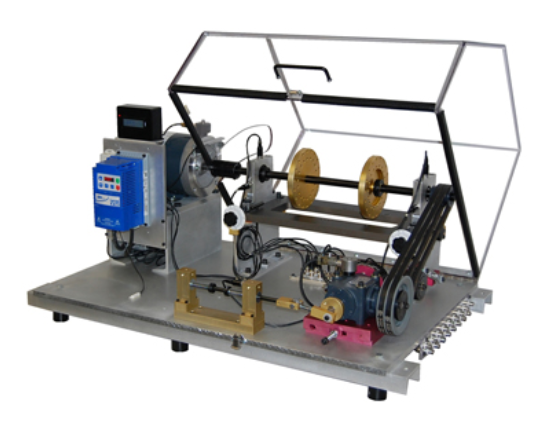

# gearbox-anomaly-detection

Time Series Anomaly Detection Using Autoencoder and t-SNE Visualization.

## Objective

The objective of this project is to detect anomalies in the vibration data of a gearbox. For this purpose, an autoencoder model is trained using the healthy data and then the model is used to detect anomalies in the broken data. The anomalies are visualized using t-SNE.

## Steps

1. Load the data
2. ...
3. ...

## About the Data set

Gearbox Fault Diagnosis Data set include the vibration dataset recorded by using SpectraQuest’s Gearbox Fault Diagnostics Simulator.
Dataset has been recorded using 4 vibration sensors placed in four different direction, and under variation of load from '0' to '90' percent. Two different scenario are included:

1) Healthy condition and

2) Broken Tooth Condition

There are 20 files in total, 10 for healthy gearbox and 10 from broken one. Each file corresponds to a given load from 0% to 90% in steps of 10%.

The dataset is available at: [Gearbox Fault Diagnosis Data Set](https://www.kaggle.com/datasets/brjapon/gearbox-fault-diagnosis)

## About SpectraQuest

SpectraQuest, Inc. is a developer and manufacturer of complete Turn-key Systems for training and diagnosis in machine vibration analysis, rotor balancing, alignment, and shaft/coupling alignment. SpectraQuest also produces a wide variety of products for the measurement and analysis of vibration, noise, and balancing.

Learn more in: [SpectraQuest](https://spectraquest.com/)
